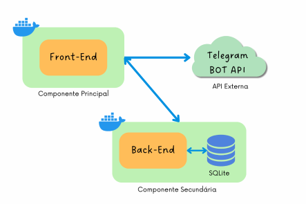

# Gestão de Validades de um Mini Mercado Autônomo (Front-End)
## 1. Introdução

Este projeto é parte do MVP - _Minimum Viable Product_ - da _Sprint_ **Arquitetura de _Software_** do Curso de Engenharia de Software da PUC-Rio. O MVP é composto de um Front-End, que se comunica com uma API Externa (Telegram BOT API), e de um Back-End, com persistência de dados em um banco SQLite, conforme ilustrado na Figura abaixo. Neste repositório encontra-se a parte do Front-end da aplicação. A parte do back-end pode ser acessada em [MVP_Arquitetura_API](https://github.com/CarolinaRamalhoGit/MVP_Arquitetura_API).



>O projeto desenvolvido objetiva a facilitação de controle de datas de vencimento de produtos de um *Minimercado Autônomo*. Este tipo de empreendimento, que ganhou força durante a pandemia de Covid-19, é uma loja de conveniências, sem funcionários, disponibilizadas em sua maior parte dentro de condomínios residenciais.

Devido ao seu baixo custo de implantação, este nicho de mercado atraiu pequenos empreendedores e vem apresentando um grande crescimento tanto em número de unidades instaladas quanto em número de franqueadoras que oferecem um grande suporte para o funcionamento dos mesmos, incluindo a solução tecnológica que possibilita a gestão de inventário e os meios de pagamentos, via totens de autoatendimento.

Uma das dores, contudo, encontradas pelos pequenos, e muitas vezes inexperientes, empreendedores é o controle da validade dos produtos ofertados, funcionalidade não disponível em algumas das principais soluções deste nicho de negócio.

>Desta forma, este projeto visa, de forma bastante simplificada, implementar um banco de dados no qual seja possível consultar uma lista dos produtos com suas respectivas quantidades e datas de validade, para que, de posse desta informação, os produtos possam ser substituídos na loja e novas compras de seu estoque possam ser providenciadas. Além da consulta, é possível a inserção de novos itens e a exclusão de itens existentes. 

## 2. Front-End
O front-end é composto por uma seção de exibição da lista de produtos cadastrados, uma de adição de novos produtos e uma terceira, de consulta dos produdtos que estão próximos ao vencimento com o envio do resultado pelo Telegram. Para isto, faz-se uso de uma API externa, a **Telegram BOT API** ([clique aqui para acessar a documentação da API](https://core.telegram.org/api#bot-api)) 

Na seção de exibição de produtos cadastrados, que são apresentados em formato de tabela, foi implementado um botão de exclusão para cada item. Esta exclusão tem por objetivo principal a retirada da lista de controle daqueles itens já retirados fisicamente da loja e do estoque por terem suas validades ultrapassadas ou próximas da data de vencimento. Importa destacar que, para evitar cliques acidentais, no front-end esta exclusão passa por uma etapa de confirmação via mensagem.

A seção de adição é responsável por alimentar a tabela com as novas mercadorias que entram no estoque do mini-mercado, guardando suas respectivas quantidades e datas de vencimnento (validade). Nesta seção foi implementado um dropdown para o atributo nome do produto, para que sejam adicionados apenas itens cujos nomes façam parte de uma lista pré-cadastrada, evitando, assim, erros de digitação e nomes diferentes para um mesmo produto.

Por fim, na seção de produtos próximos ao vencimento, foi implementada uma busca à lista de produtos existentes e que possuem validade em até três dias da data atual. A lista resultante é exibida e uma mensagem é disparada para o Telegram cadastrado. Esta funcionalidade impulsiona um maior controle de produtos expostos nos minimercados, permitindo a fácil identificação daqueles que precisam ser retirados das prateleiras por conta da proximidade de seu vencimento. 

## 3. Execução do Front-End

### 3.1 Pré-requisitos

1. Faz-se necessário **alterar as credenciais** na função para enviar lista de próximos ao vencimento, pelo Telegram, no arquivo Scripts.js.

    ```js
    async function envioTelegram(message) {
            // Definindo as variáveis de envio
            const botToken = "INSERIR O TOKEN DO BOT AQUI";
            const chatId = "INSERIR O SEU CHAT ID AQUI";
    ```

    Obs: Caso desconheça o seu CHAT ID do Telegram, basta iniciar uma conversa (buscar na ferramenta de lupa) com o bot **Get My ID** (nome de usuário: @getmyid_arel_bot) que ele retornará a mensagem com seu CHAT ID.

2. Faz-se necessário, ainda, permitir que seu Telegram possa receber mensagens do bot deste MVP. Para isto, basta iniciar uma conversa (buscar na ferramenta de lupa) com o bot **MVP_CGR_bot**.


### 3.2 Como executar por meio do Docker

1. Certifique-se de ter o [Docker](https://docs.docker.com/engine/install/) instalado e **em execução** em sua máquina.

2. No terminal, navegue até o diretório que contém o Dockerfile e os arquivos de aplicação (MVP_API) e execute, **como administrador**, o seguinte comando para construir a imagem Docker:

        $ docker build -t nome_da_sua_imagem .

3. Uma vez criada a imagem, para executar o container com compartilhamento da base de dados entre o host e o guest, basta executar, **como administrador**, seguinte o comando:

        $ docker run --name nome_do_seu_container -p 8080:80 nome_da_sua_imagem

4. Uma vez que o container esteja sendo executado, para acessar o Front-end, basta abrir [http://localhost:8080/#/](http://localhost:8080/#/) no navegador.


## 3.3. Como executar sem o Docker

- Para acessar a página da aplicação, basta fazer o download do projeto e abrir o arquivo index.html no seu browser.

- Para vê-la funcionando, faz-se necessário realizar o procesamento da API previamente. Para isso executar em seu terminal, no diretório da API:

        (env)$ flask run --host 0.0.0.0 --port 5000


## 4. Considerações
Por se tratar de um MVP, algumas funcionalidades do Front-End não foram priorizadas neste momento, ficando sua implementação para as versões futuras da aplicação. Dentre as já mapeadas, destacam-se as listadas a seguir:

- Ferramenta de busca por nome do produto;
- Possibilidade de inserção de novos produtos na dropdown de produtos cadastrados;
- Notificações automáticas de produtos próximos ao vencimento;
- Relatórios.